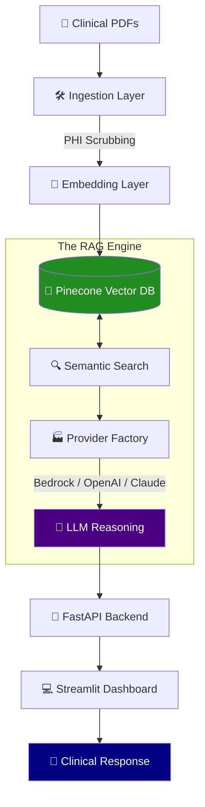

# Clinical Intelligence RAG 🏥 🤖

[](eval_results.json) [](eval_results.json) [](eval_results.json)

**Production RAG for medical documents.** Answer clinical questions. Swap LLMs (OpenAI/Anthropic/Bedrock) in `.env`.

## Quick Start

```bash
docker-compose up --build
# API:  http://localhost:8000/docs
# UI:   http://localhost:8501
```

### Project Architecture



## Features

- 📄 Upload PDFs  
- 💬 Ask questions → AI answers from docs  
- 📥 Export analysis  
- 🔐 De-identify PHI (HIPAA)  
- ⚡ 20-30% fewer tokens (compression)  
- 🔄 Any LLM (swap in `.env`)  
- ✅ Validated (F:1.00, P:1.00)

## Quality

| Metric | Score |
|--------|-------|
| Faithfulness | 1.00 |
| Relevancy | 0.97 |
| Precision | 1.00 |
| **Overall** | **0.99** |

## Docs

- [SETUP.md](docs/SETUP.md) - Install
- [API.md](docs/API.md) - REST API
- [UI.md](docs/UI.md) - Dashboard
- [FEATURES.md](docs/FEATURES.md) - Advanced
- [TROUBLESHOOTING.md](docs/TROUBLESHOOTING.md) - Help
- [DOCKER.md](docs/DOCKER.md) - Deploy
- [ARCHITECTURE.md](docs/ARCHITECTURE.md) - Design

## Tech

FastAPI • Streamlit • LangChain • Pinecone • Ragas • Docker

## What's Inside

✅ Provider Factory (swap LLMs)  
✅ Contextual Compression (20-30% tokens)  
✅ PHI De-identification (HIPAA)  
✅ Gold QA Benchmarks  
✅ Ragas Evaluation  

## Help

[SETUP.md](docs/SETUP.md) • [API.md](docs/API.md) • [UI.md](docs/UI.md) • [TROUBLESHOOTING.md](docs/TROUBLESHOOTING.md)

—

`docker-compose up --build` → http://localhost:8501
  "metrics": {
    "faithfulness": 1.0,
    "answer_relevancy": 0.98,
    "context_precision": 1.0
  }
}
```

**Run Evaluation:**
```bash
python eval/evaluate_rag.py
```

**Expected Results:**
- Faithfulness: 1.00/1.00
- Answer Relevancy: 0.97/1.00
- Context Precision: 1.00/1.00
- Overall Score: 0.99/1.00

---

## 🩺 Troubleshooting

**ValidationException (Bedrock):** Ensure your AWS region supports the selected model and that you have active model access in your Bedrock console.

**IndexNotFound (Pinecone):** Ensure the `PINECONE_INDEX_NAME` in your `.env` matches the index you created in the Pinecone dashboard.

**ModuleNotFoundError:** Ensure you have activated your virtual environment:
```bash
# On Windows:
.venv\Scripts\Activate.ps1
# On Linux/Mac:
source .venv/bin/activate
```

**No working Bedrock models found:** This is expected if you don't have an AWS account or Bedrock access. The system automatically falls back to Anthropic (Claude 3.5 Sonnet) or OpenAI (GPT-4o) as configured in your `.env`.

---

## 🔍 Optional: Enable LangChain Tracing (LangSmith)

For debugging and monitoring RAG pipeline execution, you can enable **LangChain tracing** via [LangSmith](https://smith.langchain.com):

1. **Sign up for LangSmith** (free tier available)
2. **Get your API key** from LangSmith dashboard
3. **Add to your `.env`:**
   ```bash
   LANGCHAIN_TRACING_V2=true
   LANGCHAIN_API_KEY=your-langsmith-api-key
   ```

4. **Run your queries** - traces will automatically be sent to LangSmith:
   ```bash
   python test_query.py
   ```

The system will print: `🔍 LangChain tracing enabled - traces will be sent to LangSmith`

**Benefits:**
- Monitor token usage and latency
- Debug RAG chain execution step-by-step
- Track LLM calls, embeddings, and retrieved context
- Visualize the complete prompt flow