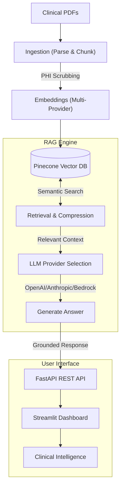

# Clinical Intelligence RAG

[](eval_results.json) [](eval_results.json) [](eval_results.json)

A privacy-first RAG pipeline for healthcare: PHI scrubbing on ingest, multi-provider LLM inference, and strict context grounding validated at Faithfulness 1.00.

## Quick Start

```bash
docker-compose up --build
# API:  http://localhost:8000/docs
# UI:   http://localhost:8501
```

---

## The Problem

Clinical PDFs and discharge summaries are unstructured. Querying them with a generative model introduces hallucination risk — the model interpolates beyond retrieved context. In a healthcare setting, that failure mode is not acceptable.

## The Architecture

Documents are chunked with overlap using LangChain's text splitter before embedding, preserving sentence boundaries and reducing context fragmentation. Vectors are stored in **Pinecone** using **OpenAI `text-embedding-3-small`** (1536 dimensions by default; swap via `.env`). At query time, a **contextual compression** step filters retrieved chunks to only the segments semantically relevant to the question — reducing token overhead by 20–30% and keeping the LLM prompt tight.

LLM providers are pluggable: OpenAI, Anthropic, or AWS Bedrock, configured entirely via `.env`. No code changes required to switch.

PHI is scrubbed from document text before embedding. Scrubbed content is never written to the vector index.


```mermaid
graph TD
    A["Clinical PDFs"] --> B["Ingestion (Parse & Chunk)"]
    B -->|PHI Scrubbing| C["Embeddings (Multi-Provider)"]
    C --> D[("Pinecone Vector DB")]

    subgraph RAG["RAG Engine"]
    D <-->|Semantic Search| E["Retrieval & Compression"]
    E -->|Relevant Context| F["LLM Provider Selection"]
    F -->|OpenAI/Anthropic/Bedrock| G["Generate Answer"]
    end

    G -->|Grounded Response| H["FastAPI REST API"]

    subgraph UI["User Interface"]
    H --> I["Streamlit Dashboard"]
    I --> J["Clinical Intelligence"]
    end
```

## The Objective

Accelerate clinical data discovery — surfacing relevant findings across patient records, discharge notes, and lab reports — while enforcing strict context boundaries: the system answers only from retrieved context, never from model weights.

---

## Evaluation

| Metric | Score |
|--------|-------|
| Faithfulness | 1.00 |
| Answer Relevancy | 0.97 |
| Context Precision | 1.00 |
| **Overall** | **0.99** |

```bash
python eval/evaluate_rag.py
```

## Tech Stack

| Layer | Technology | Purpose |
|-------|-----------|---------|
| Backend API | FastAPI | REST endpoints, async request handling |
| Frontend UI | Streamlit | Interactive dashboard, document upload |
| LLM Orchestration | LangChain | Chain-of-thought reasoning, prompt management |
| Vector Database | Pinecone | Semantic search, embeddings storage |
| Evaluation | Ragas | Faithfulness, Precision, Recall metrics |
| Containerization | Docker Compose | Multi-service orchestration |
| LLM Providers | OpenAI, Anthropic, AWS Bedrock | Plug-and-play multi-provider support |
| Monitoring | LangSmith | Pipeline tracing, token tracking, latency |

## Docs

- [SETUP.md](docs/SETUP.md) — Install and configure
- [API.md](docs/API.md) — REST API reference
- [ARCHITECTURE.md](docs/ARCHITECTURE.md) — Design decisions
- [MONITORING.md](docs/MONITORING.md) — LangSmith tracing
- [TROUBLESHOOTING.md](docs/TROUBLESHOOTING.md) — Common issues

---

## Troubleshooting

**ValidationException (Bedrock):** Ensure your AWS region supports the selected model and that you have active model access in your Bedrock console.

**IndexNotFound (Pinecone):** Ensure `PINECONE_INDEX_NAME` in `.env` matches the index you created in the Pinecone dashboard.

**No working Bedrock models found:** The system falls back automatically to Anthropic (Claude 3.5 Sonnet) or OpenAI (GPT-4o) as configured in `.env`.

**ModuleNotFoundError:** Activate your virtual environment before running:

```bash
# Windows
.venv\Scripts\Activate.ps1
# Linux/Mac
source .venv/bin/activate
```

**Enable LangSmith tracing** (optional, for debugging pipeline execution):

```bash
LANGCHAIN_TRACING_V2=true
LANGCHAIN_API_KEY=your-langsmith-api-key
```
